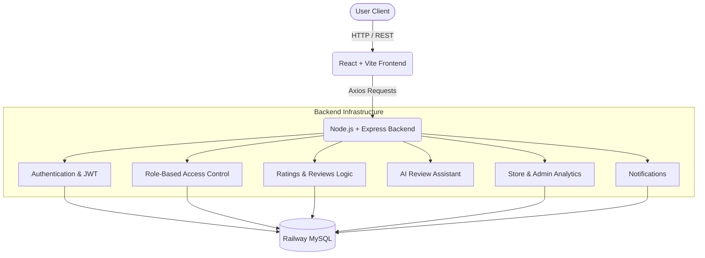

# Roxiler Store Ratings

Roxiler Store Ratings is a comprehensive, role-based store rating and review platform. It enables customers to discover local stores, submit ratings and reviews (with AI assistance), and allows store owners to monitor customer feedback and platform analytics for their assigned stores. Administrators oversee the entire platform, managing users, stores, and platform-wide analytics.

---

## 1. PROJECT OVERVIEW

**What it does:**  
A full-stack web application that centralizes store ratings. It bridges the gap between consumers seeking reliable store reviews and store owners needing actionable feedback. 

**The problem it solves:**  
Customers often struggle to find aggregated, trustworthy local store ratings. Store owners lack an isolated, dedicated dashboard to view their specific store analytics, rating trends, and customer reviews. This platform solves both issues efficiently.

**Target Audience (Roles):**
1. **System Administrator:** Oversees platform data, users, and all stores.
2. **Normal User:** Discovers stores, reads reviews, and submits ratings/reviews.
3. **Store Owner:** Manages their assigned store profile and views store-specific analytics/reviews.

---

## 2. KEY FEATURES

### ADMIN
- **Admin authentication:** Secure login for system administrators.
- **Dashboard statistics:** Platform-wide metrics (total users, stores, ratings, reviews, etc.).
- **User management:** View, filter, sort, and inspect details of all platform users.
- **Store & Owner management:** Create new users, store owners, admins, and stores.
- **Platform analytics:** Comprehensive overview of ratings, reviews, and activity trends across the platform.

### NORMAL USER
- **Authentication:** Registration, secure login, and password change functionality.
- **Store discovery:** Browse all platform stores with searching by store name or address.
- **Store details:** View store information, overall rating, and all customer reviews.
- **Ratings & Reviews:** 
  - Submit integer ratings (1-5).
  - Write detailed reviews.
  - Update or modify previously submitted ratings.
  - **AI-assisted reviews:** Optionally use AI to draft and polish reviews based on aspect scores and notes.
- **Notifications:** Receive alerts when relevant actions occur.

### STORE OWNER
- **Authentication:** Secure login and password change functionality.
- **Assigned-store dashboard:** View analytics exclusively for the stores assigned to their account.
- **Feedback analytics:** 
  - Average rating and total rating counts.
  - Rating distribution (1 to 5 stars).
  - Activity trends over time (All-time, 7 days, 30 days).
- **Customer reviews:** Read customer reviews submitted for their specific stores.
- **Store profile:** View and manage basic store details.
- **Notifications:** Receive real-time alerts when a customer submits a new review or rating for their store.
- **Ownership-based data isolation:** Strict backend rules ensure owners can *only* access their own store data.

---

## 3. TECH STACK

**Frontend:**
- React 19
- Vite
- Tailwind CSS
- React Router DOM
- React Query (@tanstack/react-query)
- React Hook Form
- Axios
- Lucide React (Icons)
- Sonner (Toast Notifications)

**Backend:**
- Node.js
- Express.js
- MySQL2 (Promise wrapper)
- jsonwebtoken (JWT)
- bcrypt
- Multer & Cloudinary (Media handling)

**Database:**
- Railway MySQL

**Security & Validation:**
- Zod (Schema validation on both frontend and backend)
- JWT (Stateless authentication)
- Role-Based Access Control (RBAC) via Express middleware

---

## 4. SYSTEM ARCHITECTURE



---

## 5. USER ROLE & PERMISSION MATRIX

| Capability | Admin | Normal User | Store Owner |
| :--- | :---: | :---: | :---: |
| Login / Logout | ✅ | ✅ | ✅ |
| Change Password | ✅ | ✅ | ✅ |
| Manage Platform Users | ✅ | ❌ | ❌ |
| Create Stores | ✅ | ❌ | ❌ |
| View All Stores | ✅ | ✅ | ❌ |
| View Assigned Store(s) Only | ❌ | ❌ | ✅ |
| Submit Ratings & Reviews | ❌ | ✅ | ❌ |
| Update Own Rating | ❌ | ✅ | ❌ |
| View Platform Analytics | ✅ | ❌ | ❌ |
| View Store Analytics | ❌ | ❌ | ✅ (Own store only) |
| Receive Store Notifications| ❌ | ❌ | ✅ (Own store only) |

---

## 6. APPLICATION WORKFLOW

### NORMAL USER:
1. **Register/Login** to the platform.
2. **Browse Stores** and use the search bar to filter by name or address.
3. **Open Store** to view details and customer feedback.
4. **Submit Rating/Review** (1-5 stars) manually or via the AI Assistant.
5. **Update Rating** if their opinion changes.
6. **Change Password** via the secure authenticated header if desired.
7. **Logout** when finished.

### STORE OWNER:
1. **Login** to the platform.
2. **Owner Dashboard** loads immediately, displaying their assigned store.
3. **View Rating Statistics** (average rating, distribution, trends).
4. **View Customer Reviews** left by Normal Users.
5. **Receive Notifications** dynamically when a user reviews their store.
6. **Change Password** via the header action.
7. **Logout**.

### ADMIN:
1. **Login** to the platform.
2. **Admin Dashboard** displays high-level platform statistics.
3. **Manage Users & Store Owners** (view, create, filter).
4. **Manage Stores** (create new stores, assign them to Store Owners).
5. **View Platform Analytics**.
6. **Logout**.

---

## 7. DATABASE

**Database:** Railway MySQL

The platform utilizes a highly relational MySQL schema. 

**Core Tables:**
- `users`: Stores all platform users, roles (`ADMIN`, `USER`, `STORE_OWNER`), and hashed passwords.
- `stores`: Stores business profiles. Includes an `owner_id` foreign key linking to the `users` table.
- `ratings`: Stores user feedback. Links to `user_id` and `store_id`. Contains integer ratings (1-5) and text reviews.
- `notifications`: Stores user-scoped alerts (e.g., `NEW_REVIEW`, `STORE_ASSIGNMENT`).
- `products`: Supported schema for store inventory (disabled in current UI iteration by design).
- `password_reset_tokens`: Manages secure, time-limited tokens for password resets.

**Data Integrity:**
Strict foreign keys ensure that ratings are tied to valid users and stores, and stores are tied to valid owners. Orphaned data prevention is enforced at the database level.

---

## 8. AUTHENTICATION & SECURITY

- **JWT Authentication:** Secure, stateless sessions. Tokens expire automatically and do not store sensitive information.
- **Password Hashing:** Passwords are encrypted using `bcrypt` (cost factor 10) before database insertion.
- **Backend Authorization (RBAC):** Express middleware (`requireRole`) protects routes at the server level. Frontend routing limits access, but backend APIs remain the authoritative gatekeeper.
- **Data Isolation:** Store Owner queries dynamically resolve against `req.user.id` to guarantee owners cannot access cross-store analytics or reviews.
- **SQL Injection Prevention:** All database queries utilize parameterized inputs via `mysql2/promise`.
- **Environment Security:** Secrets (Database credentials, JWT secret) are strictly managed via backend `.env` variables and are never leaked to the React frontend.

---

## 9. VALIDATION RULES

Extensive validation is enforced on both the client (React Hook Form) and server (Express/Zod).

- **Name:** Minimum 20 characters, Maximum 60 characters.
- **Address:** Maximum 400 characters.
- **Password:** 8–16 characters, must include at least one uppercase letter and at least one special character.
- **Email:** Standard valid email format.
- **Rating:** Strictly an integer from 1 to 5.

Failure to meet these rules yields immediate, clean UI feedback and strict 400 Bad Request API responses.

---

## 10. ANALYTICS

**Store Owner Analytics (Ownership-Scoped):**
- Average rating calculation.
- Total ratings and text reviews count.
- Rating distribution (counts of 1, 2, 3, 4, and 5-star ratings).
- Activity over time (timeline of ratings/reviews).
- Filterable by date ranges (e.g., All time, Last 7 days, Last 30 days).

**Admin Analytics:**
- Total counts for platform Users, Stores, and Store Owners.
- Total platform-wide ratings and reviews.
- Global average rating.

---

## 11. NOTIFICATIONS

A robust, user-scoped notification system alerts users to relevant platform events:
- **NEW_REVIEW / NEW_RATING:** Store Owners are notified instantly when a customer rates or reviews their assigned store.
- **STORE_ASSIGNMENT:** Store Owners are alerted when an Admin assigns them a new store.

The UI supports fetching unread counts, marking individual notifications as read, and marking all notifications as read.

---

## 12. AI FUNCTIONALITY

**AI Review Assistant**
- **Where it is used:** Normal Users can utilize the assistant when submitting or updating a rating for a store.
- **Input:** Users provide their integer rating score, optional aspect scores (e.g., Cleanliness, Service), and a brief unstructured note.
- **Output:** The AI generates a polished, coherent, and professional review text.
- **Interaction:** The generated review populates the review text box as a "draft". The user can then edit the draft manually before hitting the final submit button.
- **Security:** Prompts are heavily sanitized and isolated as data to prevent prompt injection. Rate limiting protects the endpoint from abuse.

---

## 13. PROJECT STRUCTURE

```text
project-root/
├── backend/
│   ├── database/          # Migration and seed scripts
│   ├── scripts/           # Utility, testing, and validation scripts
│   ├── src/
│   │   ├── config/        # Environment and DB configuration
│   │   ├── controllers/   # Express route handlers
│   │   ├── middleware/    # Auth, RBAC, and Error handling
│   │   ├── routes/        # API route definitions
│   │   ├── utils/         # Helpers, Zod validation, analytics logic
│   │   └── server.js      # Application entry point
│   ├── package.json
│   └── .env.example
├── frontend/
│   ├── public/            # Static assets
│   ├── src/
│   │   ├── components/    # Reusable UI components
│   │   ├── context/       # React Context (Auth)
│   │   ├── hooks/         # Custom React hooks
│   │   ├── layouts/       # App shell and navigation
│   │   ├── lib/           # Axios config, API wrappers
│   │   ├── pages/         # Page-level components
│   │   ├── routes/        # React Router configuration
│   │   ├── index.css      # Tailwind base styles
│   │   └── main.jsx       # React entry point
│   ├── package.json
│   ├── vite.config.js
│   └── .env.example
├── .gitignore
└── README.md
```

---

## 14. LOCAL DEVELOPMENT SETUP

### Prerequisites
- Node.js (v18+)
- npm
- Railway MySQL database connection (or a local MySQL instance matching the schema)

### Clone & Install
```bash
git clone https://github.com/Shailesh-Paul/user_review_system.git
cd user_review_system
```

### Backend Setup
```bash
cd backend
npm install

# Copy environment variables
cp .env.example .env

# Configure .env with your MySQL credentials and JWT secret
# DB_HOST, DB_USER, DB_PASSWORD, DB_NAME, JWT_SECRET

# Run database migrations and seed demo data
npm run migrate
npm run seed:indian

# Start the backend server
npm start
```
*The backend will run on `http://localhost:5000`.*

### Frontend Setup
Open a new terminal window:
```bash
cd frontend
npm install

# Start the Vite development server
npm run dev
```
*The frontend will run on `http://localhost:5173` (or 5174).*

---
*Developed as a comprehensive demonstration of full-stack engineering, secure architecture, and modern React practices.*
